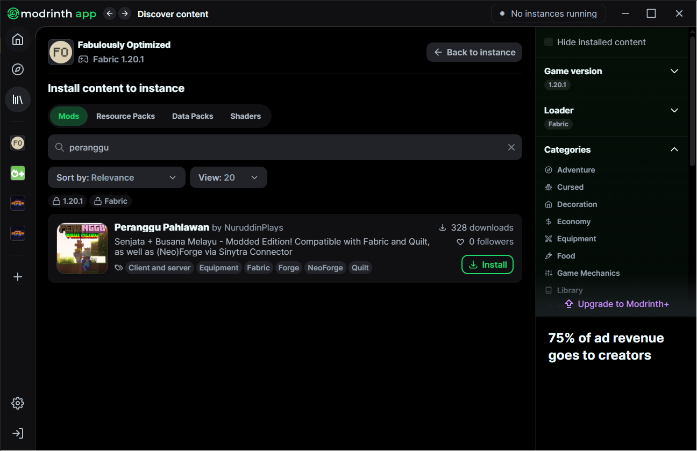

# Pemasangan

## Mod yang disarankan untuk digunakan bersama mod Peranggu Pahlawan 

* **Fabric (1.20.1 & 1.21.1)**
  * [Fabulously Optimized](https://download.fo/modrinth) _(disarankan)_ **(1.20.1: v5.4.1 | 1.21.1: v6.4.0)**
* **NeoForge (1.21.1)**
  * [Forgeulously Optimized](https://modrinth.com/modpack/forgeulously-optimized/) **(v1.1.3)**
* **Forge (1.20.1)**
  * [Forgeulously Optimized](https://modrinth.com/modpack/forgeulously-optimized/) **(v1.0.5)**
* **Quilt (1.20.1)**
  * [Sodium Plus](https://modrinth.com/modpack/sodiumplus/) **(v2.2.11)**

## Modrinth App _(disarankan)_ 

1. Buka Modrinth App
2. Buka  `|||\` "Library"
3. Klik pada modpack pilihan anda
4. Klik `+ Install content`
5. Cari Peranggu Pahlawan pada tab mod dan klik `⤓ Install`
6. Klik `Back to instance` lalu klik `Play`

<figure><figcaption></figcaption></figure>

## Prism Launcher _(disarankan)_ 

1. Buka Prism Launcher
2.
   Klik kanan pada modpack pilihan anda, kemudian klik Edit
3. Klik pada `Mods`, kemudian klik `Download mods`
4. Cari mod Peranggu Pahlawan
5. Pilih mod tersebut dan klik Pilih mod untuk muat turun.
6. Klik `Review and confirm`.
7. Tetingkap pengesahan muncul, klik `OK`.
8. Mod akan dimuat turun dan ditambahkan ke dalam instance anda.

<figure><figcaption></figcaption></figure>

Pelancar Minecraft (vanila)

**Tutorial di sini hanya terpakai untuk modpack Fabulously Optimized, lihat kaedah pemasangan vanila untuk modpack tersebut** [**di sini**](https://wiki.download.fo/install-instructions#minecraft-launcher-vanilla) **(untuk 1.20.1 guna FO 5.4.1, untuk 1.21.1 guna FO 6.4.0)**

1. Buka Pelancar Minecraft, klik pada `Installations` / `Pemasangan`
2. Hover pada pemasangan Fabulously Optimized, klik 📂
3. [Buka halaman ini di Modrinth](https://modrinth.com/mod/peranggu-pahlawan), dan pergi ke halaman _Versions_
4. Klik `⤓` pada versi terkini yang serasi dengan versi Minecraft anda
5. Setelah dimuat turun, salin fail JAR mod itu ke folder "mods" untuk modpack.
6. Jalankan permainan seperti biasa. Mod tersebut sekarang sudah dipasang!
