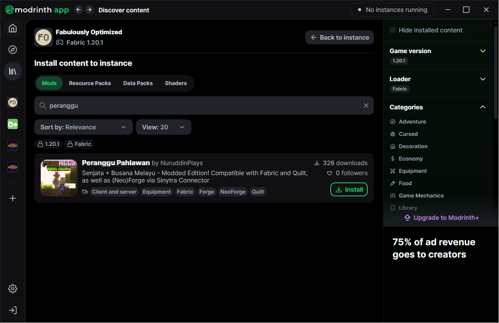
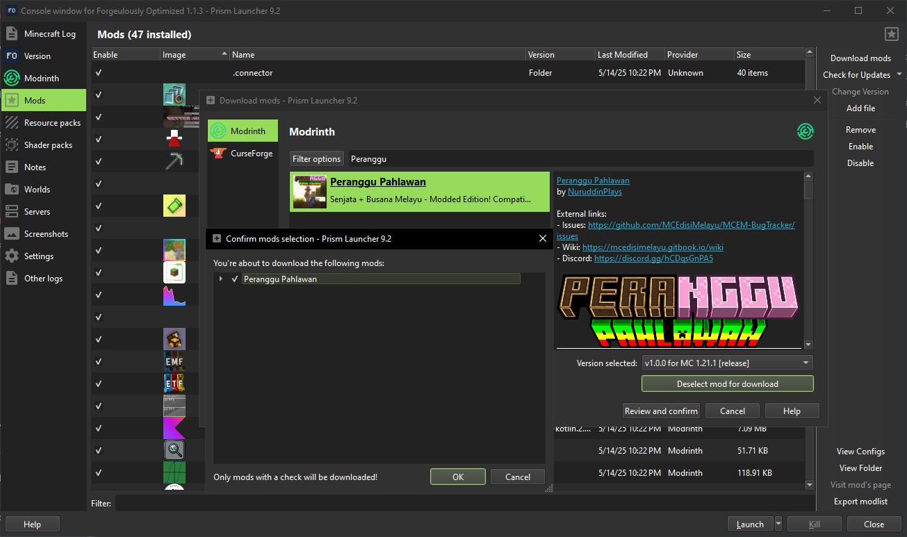

# Installation (Java Edition)

## Recommended modpack to use with the Peranggu Pahlawan mod 

* **Fabric (1.20.1 & 1.21.1)**
  * [Fabulously Optimized](https://download.fo/modrinth) _(recommended)_ **(1.20.1: v5.4.1 | 1.21.1: v6.4.0)**
* **NeoForge (1.21.1)**
  * [Forgeulously Optimized](https://modrinth.com/modpack/forgeulously-optimized/) **(v1.1.3)**
* **Forge (1.20.1)**
  * [Forgeulously Optimized](https://modrinth.com/modpack/forgeulously-optimized/) **(v1.0.5)**
* **Quilt (1.20.1)**
  * [Sodium Plus](https://modrinth.com/modpack/sodiumplus/) **(v2.2.11)**

## Modrinth App _(recommended)_ 

1. Open Modrinth App
2. Open `|||\` "Library"
3. Click on the modpack of your choice
4. Click `+ Install content`
5. Search Peranggu Pahlawan on the mod tab and click `⤓ Install`
6. Click `Back to instance` and click `Play`

<figure><figcaption></figcaption></figure>

## Prism Launcher _(recommended)_ 

1. Open Prism Launcher
2. Right-click on the modpack of your choice, then `Edit`
3. Click on `Mods`, then `Download mods`
4. Search for the Peranggu Pahlawan mod
5. Select the mod(s) and click `Select mod for download`.
6. Click `Review and confirm`.
7. A confirmation window appears, click `OK`.
8. The mods will be downloaded and added to your instance.

<figure><figcaption></figcaption></figure>

## Minecraft Launcher (vanilla) 

**The tutorial here is only applicable to the Fabulously Optimized modpack, see the vanilla installation method for the modpack** [**here**](https://wiki.download.fo/install-instructions#minecraft-launcher-vanilla) **(for 1.20.1 use FO 5.4.1, for 1.21.1 use FO 6.4.0)**

1. Open Minecraft Launcher, click on `Installations`
2. Hover on the Fabulously Optimized installation, click 📂
3. [Open this page on Modrinth](https://modrinth.com/mod/peranggu-pahlawan), and go to its _Versions_ page
4. Click `⤓` on the latest version that is compatible with your Minecraft version
5. Once downloaded, copy the JAR file to the pack's "mods" folder.
6. Run the game as usual. You should now have the mod installed!
