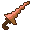

# Item Table

## Senjata + Busana Melayu CIT Pack - CIT Item Table

\
To change the item, rename the weapon/armor of your choice in an anvil based on the following table\
Untuk mengubah itemnya, namakan semula senjata/zirah pilihan anda menggunakan andas mengikut jadual berikut

\*= The leather armor icon shown are white because it got it's colors in-game\
Types: Senjata = Weapon | Busana (**L**elaki/**P**erempuan) = Attire (**M**ale/**F**emale)

#### Notes

a - Since all versions supported by this pack does not contain copper tools and armor, iron tools and armor are used as substitues / Memandangkan semua versi yang disokong pek ini tidak mempunyai alatan dan zirah tembaga, alatan dan zirah besi digunakan sebagai pengganti

### Item Table

<table data-header-hidden><thead><tr><th width="87"></th><th width="104" align="center"></th><th width="109" align="center"></th><th width="58" align="center"></th><th width="107" align="center"></th><th width="103" align="center"></th><th width="104" align="center"></th><th width="100" align="right"></th><th width="72" align="center"></th></tr></thead><tbody><tr><td>Type</td><td align="center">Item</td><td align="center">Replace?</td><td align="center">Item Icon</td><td align="center">English Name</td><td align="center">Nama Bahasa Melayu Rumi</td><td align="center">Nama Bahasa Indonesia</td><td align="right">نام بهاس ملايو توليسن جاوي</td><td align="center">Notes</td></tr><tr><td>Senjata</td><td align="center">Wooden Keris</td><td align="center">Wooden Sword</td><td align="center"></td><td align="center"><code>Wooden Keris</code></td><td align="center"><code>Keris Kayu</code></td><td align="center">&#x3C;- sama</td><td align="right">کريس کايو</td><td align="center"></td></tr><tr><td>Senjata</td><td align="center">Wooden Keris (Legacy)</td><td align="center">Wooden Sword</td><td align="center"></td><td align="center"><code>Wooden Old Keris</code></td><td align="center"><code>Keris Lama Kayu</code></td><td align="center">&#x3C;- sama</td><td align="right">کريس لاما کايو</td><td align="center"></td></tr><tr><td>Senjata</td><td align="center">Wooden Parang</td><td align="center">Wooden Axe</td><td align="center"></td><td align="center"><code>Wooden Parang</code></td><td align="center"><code>Parang Kayu</code></td><td align="center">&#x3C;- sama</td><td align="right">ڤارڠ کايو</td><td align="center"></td></tr><tr><td>Busana (L)</td><td align="center">Songkok</td><td align="center">Leather Cap</td><td align="center">*</td><td align="center"><code>Songkok</code></td><td align="center"><code>Songkok</code></td><td align="center">&#x3C;- sama</td><td align="right">سوڠکوق</td><td align="center"></td></tr><tr><td>Busana (L)</td><td align="center">Leather Baju Melayu</td><td align="center">Leather Tunic</td><td align="center">*</td><td align="center"><code>Leather Baju Melayu</code></td><td align="center"><code>Baju Melayu Kulit</code></td><td align="center">&#x3C;- sama</td><td align="right">باجو ملايو کوليت</td><td align="center"></td></tr><tr><td>Busana (L)</td><td align="center">Leather Seluar Melayu</td><td align="center">Leather Pants</td><td align="center">*</td><td align="center"><code>Leather Seluar Melayu</code></td><td align="center"><code>Seluar Melayu Kulit</code></td><td align="center"><code>Celana Melayu Kulit</code></td><td align="right">سلوار ملايو کوليت</td><td align="center"></td></tr><tr><td>Busana (L)</td><td align="center">Leather Samping</td><td align="center">Leather Boots</td><td align="center">*</td><td align="center"><code>Leather Samping</code></td><td align="center"><code>Samping Kulit</code></td><td align="center">&#x3C;- sama</td><td align="right">سمڤيڠ کوليت</td><td align="center"></td></tr><tr><td>Busana (P)</td><td align="center">Leather Gandik</td><td align="center">Leather Cap</td><td align="center">*</td><td align="center"><code>Leather Gandik</code></td><td align="center"><code>Gandik Kulit</code></td><td align="center">&#x3C;- sama</td><td align="right">ݢنديق کوليت</td><td align="center"></td></tr><tr><td>Busana (P)</td><td align="center">Leather Baju Kurung</td><td align="center">Leather Tunic</td><td align="center">*</td><td align="center"><code>Leather Baju Kurung</code></td><td align="center"><code>Baju Kurung Kulit</code></td><td align="center">&#x3C;- sama</td><td align="right">باجو کوروڠ کوليت</td><td align="center"></td></tr><tr><td>Busana (P)</td><td align="center">Leather Kain Sarung</td><td align="center">Leather Pants</td><td align="center">*</td><td align="center"><code>Leather Kain Sarung</code></td><td align="center"><code>Kain Sarung Kulit</code></td><td align="center">&#x3C;- sama</td><td align="right">کاٴين ساروڠ کوليت</td><td align="center"></td></tr><tr><td>Busana (P)</td><td align="center">Leather Kasut</td><td align="center">Leather Boots</td><td align="center">*</td><td align="center"><code>Leather Kasut</code></td><td align="center"><code>Kasut Kulit</code></td><td align="center">&#x3C;- sama</td><td align="right">کاسوت کوليت</td><td align="center"></td></tr><tr><td>Senjata</td><td align="center">Stone Keris</td><td align="center">Stone Sword</td><td align="center"></td><td align="center"><code>Stone Keris</code></td><td align="center"><code>Keris Batu</code></td><td align="center">&#x3C;- sama</td><td align="right">کريس باتو</td><td align="center"></td></tr><tr><td>Senjata</td><td align="center">Stone Keris (Legacy)</td><td align="center">Stone Sword</td><td align="center"></td><td align="center"><code>Stone Old Keris</code></td><td align="center"><code>Keris Lama Batu</code></td><td align="center">&#x3C;- sama</td><td align="right">کريس لاما باتو</td><td align="center"></td></tr><tr><td>Senjata</td><td align="center">Stone Parang</td><td align="center">Stone Axe</td><td align="center"></td><td align="center"><code>Stone Parang</code></td><td align="center"><code>Parang Batu</code></td><td align="center">&#x3C;- sama</td><td align="right">ڤارڠ باتو</td><td align="center"></td></tr><tr><td>Busana (L)</td><td align="center">Chainmail Tengkolok</td><td align="center">Chainmail Helmet</td><td align="center"></td><td align="center"><code>Chainmail Tengkolok</code></td><td align="center"><code>Tengkolok Rantai</code></td><td align="center"><code>Tengkuluk Rantai</code></td><td align="right">تڠکولوق رنتاي</td><td align="center"></td></tr><tr><td>Busana (L)</td><td align="center">Chainmail Baju Melayu</td><td align="center">Chainmail Chestplate</td><td align="center"></td><td align="center"><code>Chainmail Baju Melayu</code></td><td align="center"><code>Baju Melayu Rantai</code></td><td align="center">&#x3C;- sama</td><td align="right">باجو ملايو رنتاي</td><td align="center"></td></tr><tr><td>Busana (L)</td><td align="center">Chainmail Seluar Melayu</td><td align="center">Chainmail Leggings</td><td align="center"></td><td align="center"><code>Chainmail Seluar Melayu</code></td><td align="center"><code>Seluar Melayu Rantai</code></td><td align="center"><code>Celana Melayu Rantai</code></td><td align="right">سلوار ملايو رنتاي</td><td align="center"></td></tr><tr><td>Busana (L)</td><td align="center">Chainmail Samping</td><td align="center">Chainmail Boots</td><td align="center"></td><td align="center"><code>Chainmail Samping</code></td><td align="center"><code>Samping Rantai</code></td><td align="center">&#x3C;- sama</td><td align="right">سمڤيڠ رنتاي</td><td align="center"></td></tr><tr><td>Busana (P)</td><td align="center">Chainmail Gandik</td><td align="center">Chainmail Helmet</td><td align="center"></td><td align="center"><code>Chainmail Gandik</code></td><td align="center"><code>Gandik Rantai</code></td><td align="center">&#x3C;- sama</td><td align="right">ݢنديق رنتاي</td><td align="center"></td></tr><tr><td>Busana (P)</td><td align="center">Chainmail Baju Kurung</td><td align="center">Chainmail Chestplate</td><td align="center"></td><td align="center"><code>Chainmail Baju Kurung</code></td><td align="center"><code>Baju Kurung Rantai</code></td><td align="center">&#x3C;- sama</td><td align="right">باجو کوروڠ رنتاي</td><td align="center"></td></tr><tr><td>Busana (P)</td><td align="center">Chainmail Kain Sarung</td><td align="center">Chainmail Leggings</td><td align="center"></td><td align="center"><code>Chainmail Kain Sarung</code></td><td align="center"><code>Kain Sarung Rantai</code></td><td align="center">&#x3C;- sama</td><td align="right">کاٴين ساروڠ رنتاي</td><td align="center"></td></tr><tr><td>Busana (P)</td><td align="center">Chainmail Kasut</td><td align="center">Chainmail Boots</td><td align="center"></td><td align="center"><code>Chainmail Kasut</code></td><td align="center"><code>Kasut Rantai</code></td><td align="center">&#x3C;- sama</td><td align="right">کاسوت رنتاي</td><td align="center"></td></tr><tr><td>Senjata</td><td align="center">Copper Keris</td><td align="center">Iron Sword</td><td align="center">

<figure><figcaption></figcaption></figure>
</td><td align="center"><code>Copper Keris</code></td><td align="center"><code>Keris Tembaga</code></td><td align="center">&#x3C;- sama</td><td align="right">کريس تمباݢ</td><td align="center">a</td></tr><tr><td>Senjata</td><td align="center">Copper Parang</td><td align="center">Iron Axe</td><td align="center">

<figure><figcaption></figcaption></figure>
</td><td align="center"><code>Copper Parang</code></td><td align="center"><code>Parang Tembaga</code></td><td align="center">&#x3C;- sama</td><td align="right">ڤارڠ تمباݢ</td><td align="center">a</td></tr><tr><td>Busana (L)</td><td align="center">Copper Tengkolok</td><td align="center">Iron Helmet</td><td align="center">

<figure><figcaption></figcaption></figure>
</td><td align="center"><code>Copper Tengkolok</code></td><td align="center"><code>Tengkolok Tembaga</code></td><td align="center"><code>Tengkuluk Tembaga</code></td><td align="right">تڠکولوق تمباݢ</td><td align="center">a</td></tr><tr><td>Busana (L)</td><td align="center">Copper Baju Melayu</td><td align="center">Iron Chestplate</td><td align="center">

<figure><figcaption></figcaption></figure>
</td><td align="center"><code>Copper Baju Melayu</code></td><td align="center"><code>Baju Melayu Tembaga</code></td><td align="center">&#x3C;- sama</td><td align="right">باجو ملايو تمباݢ</td><td align="center">a</td></tr><tr><td>Busana (L)</td><td align="center">Copper Seluar Melayu</td><td align="center">Iron Leggings</td><td align="center">

<figure><figcaption></figcaption></figure>
</td><td align="center"><code>Copper Seluar Melayu</code></td><td align="center"><code>Seluar Melayu Tembaga</code></td><td align="center"><code>Celana Melayu Tembaga</code></td><td align="right">سلوار ملايو تمباݢ</td><td align="center">a</td></tr><tr><td>Busana (L)</td><td align="center">Copper Samping</td><td align="center">Iron Boots</td><td align="center">

<figure><figcaption></figcaption></figure>
</td><td align="center"><code>Copper Samping</code></td><td align="center"><code>Samping Tembaga</code></td><td align="center">&#x3C;- sama</td><td align="right">سمڤيڠ تمباݢ</td><td align="center">a</td></tr><tr><td>Busana (P)</td><td align="center">Copper Gandik</td><td align="center">Iron Helmet</td><td align="center">

<figure><figcaption></figcaption></figure>
</td><td align="center"><code>Copper Gandik</code></td><td align="center"><code>Gandik Tembaga</code></td><td align="center">&#x3C;- sama</td><td align="right">ݢنديق تمباݢ</td><td align="center">a</td></tr><tr><td>Busana (P)</td><td align="center">Copper Baju Kurung</td><td align="center">Iron Chestplate</td><td align="center">

<figure><figcaption></figcaption></figure>
</td><td align="center"><code>Copper Baju Kurung</code></td><td align="center"><code>Baju Kurung Tembaga</code></td><td align="center">&#x3C;- sama</td><td align="right">باجو کوروڠ تمباݢ</td><td align="center">a</td></tr><tr><td>Busana (P)</td><td align="center">Copper Kain Sarung</td><td align="center">Iron Leggings</td><td align="center">

<figure><figcaption></figcaption></figure>
</td><td align="center"><code>Copper Kain Sarung</code></td><td align="center"><code>Kain Sarung Tembaga</code></td><td align="center">&#x3C;- sama</td><td align="right">کاٴين ساروڠ تمباݢ</td><td align="center">a</td></tr><tr><td>Busana (P)</td><td align="center">Copper Kasut</td><td align="center">Iron Boots</td><td align="center">

<figure><figcaption></figcaption></figure>
</td><td align="center"><code>Copper Kasut</code></td><td align="center"><code>Kasut Tembaga</code></td><td align="center">&#x3C;- sama</td><td align="right">کاسوت تمباݢ</td><td align="center">a</td></tr><tr><td>Senjata</td><td align="center">Golden Keris</td><td align="center">Golden Sword</td><td align="center"></td><td align="center"><code>Golden Keris</code></td><td align="center"><code>Keris Emas</code></td><td align="center">&#x3C;- sama</td><td align="right">کريس امس</td><td align="center"></td></tr><tr><td>Senjata</td><td align="center">Golden Keris (Legacy)</td><td align="center">Golden Sword</td><td align="center"></td><td align="center"><code>Golden Old Keris</code></td><td align="center"><code>Keris Lama Emas</code></td><td align="center">&#x3C;- sama</td><td align="right">کريس لاما امس</td><td align="center"></td></tr><tr><td>Senjata</td><td align="center">Golden Parang</td><td align="center">Golden Axe</td><td align="center"></td><td align="center"><code>Golden Parang</code></td><td align="center"><code>Parang Emas</code></td><td align="center">&#x3C;- sama</td><td align="right">ڤارڠ امس</td><td align="center"></td></tr><tr><td>Busana (L)</td><td align="center">Golden Tengkolok</td><td align="center">Golden Helmet</td><td align="center"></td><td align="center"><code>Golden Tengkolok</code></td><td align="center"><code>Tengkolok Emas</code></td><td align="center"><code>Tengkuluk Emas</code></td><td align="right">تڠکولوق امس</td><td align="center"></td></tr><tr><td>Busana (L)</td><td align="center">Golden Baju Melayu</td><td align="center">Golden Chestplate</td><td align="center"></td><td align="center"><code>Golden Baju Melayu</code></td><td align="center"><code>Baju Melayu Emas</code></td><td align="center">&#x3C;- sama</td><td align="right">باجو ملايو امس</td><td align="center"></td></tr><tr><td>Busana (L)</td><td align="center">Golden Seluar Melayu</td><td align="center">Golden Leggings</td><td align="center"></td><td align="center"><code>Golden Seluar Melayu</code></td><td align="center"><code>Seluar Melayu Emas</code></td><td align="center"><code>Celana Melayu Emas</code></td><td align="right">سلوار ملايو امس</td><td align="center"></td></tr><tr><td>Busana (L)</td><td align="center">Golden Samping</td><td align="center">Golden Boots</td><td align="center"></td><td align="center"><code>Golden Samping</code></td><td align="center"><code>Samping Emas</code></td><td align="center">&#x3C;- sama</td><td align="right">سمڤيڠ امس</td><td align="center"></td></tr><tr><td>Busana (P)</td><td align="center">Golden Gandik</td><td align="center">Golden Helmet</td><td align="center"></td><td align="center"><code>Golden Gandik</code></td><td align="center"><code>Gandik Emas</code></td><td align="center">&#x3C;- sama</td><td align="right">ݢنديق امس</td><td align="center"></td></tr><tr><td>Busana (P)</td><td align="center">Golden Baju</td><td align="center">Golden Chestplate</td><td align="center"></td><td align="center"><code>Golden Baju Kurung</code></td><td align="center"><code>Baju Kurung Emas</code></td><td align="center">&#x3C;- sama</td><td align="right">باجو کوروڠ امس</td><td align="center"></td></tr><tr><td>Busana (P)</td><td align="center">Golden Kain Sarung</td><td align="center">Golden Leggings</td><td align="center"></td><td align="center"><code>Golden Kain Sarung</code></td><td align="center"><code>Kain Sarung Emas</code></td><td align="center">&#x3C;- sama</td><td align="right">کاٴين ساروڠ امس</td><td align="center"></td></tr><tr><td>Busana (P)</td><td align="center">Golden Kasut</td><td align="center">Golden Boots</td><td align="center"></td><td align="center"><code>Golden Kasut</code></td><td align="center"><code>Kasut Emas</code></td><td align="center">&#x3C;- sama</td><td align="right">کاسوت امس</td><td align="center"></td></tr><tr><td>Senjata</td><td align="center">Iron Keris</td><td align="center">Iron Sword</td><td align="center"></td><td align="center"><code>Iron Keris</code></td><td align="center"><code>Keris Besi</code></td><td align="center">&#x3C;- sama</td><td align="right">کريس بسي</td><td align="center"></td></tr><tr><td>Senjata</td><td align="center">Iron Keris (Legacy)</td><td align="center">Iron Sword</td><td align="center"></td><td align="center"><code>Iron Old Keris</code></td><td align="center"><code>Keris Lama Besi</code></td><td align="center">&#x3C;- sama</td><td align="right">کريس لاما بسي</td><td align="center"></td></tr><tr><td>Senjata</td><td align="center">Iron Parang</td><td align="center">Iron Axe</td><td align="center"></td><td align="center"><code>Iron Parang</code></td><td align="center"><code>Parang Besi</code></td><td align="center">&#x3C;- sama</td><td align="right">ڤارڠ بسي</td><td align="center"></td></tr><tr><td>Busana (L)</td><td align="center">Iron Tengkolok</td><td align="center">Iron Helmet</td><td align="center"></td><td align="center"><code>Iron Tengkolok</code></td><td align="center"><code>Tengkolok Besi</code></td><td align="center"><code>Tengkuluk Besi</code></td><td align="right">تڠکولوق بسي</td><td align="center"></td></tr><tr><td>Busana (L)</td><td align="center">Iron Baju Melayu</td><td align="center">Iron Chestplate</td><td align="center"></td><td align="center"><code>Iron Baju Melayu</code></td><td align="center"><code>Baju Melayu Besi</code></td><td align="center">&#x3C;- sama</td><td align="right">باجو ملايو بسي</td><td align="center"></td></tr><tr><td>Busana (L)</td><td align="center">Iron Seluar Melayu</td><td align="center">Iron Leggings</td><td align="center"></td><td align="center"><code>Iron Seluar Melayu</code></td><td align="center"><code>Seluar Melayu Besi</code></td><td align="center"><code>Celana Melayu Besi</code></td><td align="right">سلوار ملايو بسي</td><td align="center"></td></tr><tr><td>Busana (L)</td><td align="center">Iron Samping</td><td align="center">Iron Boots</td><td align="center"></td><td align="center"><code>Iron Samping</code></td><td align="center"><code>Samping Besi</code></td><td align="center">&#x3C;- sama</td><td align="right">سمڤيڠ بسي</td><td align="center"></td></tr><tr><td>Busana (P)</td><td align="center">Iron Gandik</td><td align="center">Iron Helmet</td><td align="center"></td><td align="center"><code>Iron Gandik</code></td><td align="center"><code>Gandik Besi</code></td><td align="center">&#x3C;- sama</td><td align="right">ݢنديق بسي</td><td align="center"></td></tr><tr><td>Busana (P)</td><td align="center">Iron Baju Kurung</td><td align="center">Iron Chestplate</td><td align="center"></td><td align="center"><code>Iron Baju Kurung</code></td><td align="center"><code>Baju Kurung Besi</code></td><td align="center">&#x3C;- sama</td><td align="right">باجو کوروڠ بسي</td><td align="center"></td></tr><tr><td>Busana (P)</td><td align="center">Iron Kain Sarung</td><td align="center">Iron Leggings</td><td align="center"></td><td align="center"><code>Iron Kain Sarung</code></td><td align="center"><code>Kain Sarung Besi</code></td><td align="center">&#x3C;- sama</td><td align="right">کاٴين ساروڠ بسي</td><td align="center"></td></tr><tr><td>Busana (P)</td><td align="center">Iron Kasut</td><td align="center">Iron Boots</td><td align="center"></td><td align="center"><code>Iron Kasut</code></td><td align="center"><code>Kasut Besi</code></td><td align="center">&#x3C;- sama</td><td align="right">کاسوت بسي</td><td align="center"></td></tr><tr><td>Senjata</td><td align="center">Diamond Keris</td><td align="center">Diamond Sword</td><td align="center"></td><td align="center"><code>Diamond Keris</code></td><td align="center"><code>Keris Berlian</code></td><td align="center">&#x3C;- sama</td><td align="right">کريس برليان</td><td align="center"></td></tr><tr><td>Senjata</td><td align="center">Diamond Keris (Legacy)</td><td align="center">Diamond Sword</td><td align="center"></td><td align="center"><code>Diamond Old Keris</code></td><td align="center"><code>Keris Lama Berlian</code></td><td align="center">&#x3C;- sama</td><td align="right">کريس لاما برليان</td><td align="center"></td></tr><tr><td>Senjata</td><td align="center">Diamond Parang</td><td align="center">Diamond Axe</td><td align="center"></td><td align="center"><code>Diamond Parang</code></td><td align="center"><code>Parang Berlian</code></td><td align="center">&#x3C;- sama</td><td align="right">ڤارڠ برليان</td><td align="center"></td></tr><tr><td>Busana (L)</td><td align="center">Diamond Tengkolok</td><td align="center">Diamond Helmet</td><td align="center"></td><td align="center"><code>Diamond Tengkolok</code></td><td align="center"><code>Tengkolok Berlian</code></td><td align="center"><code>Tengkuluk Berlian</code></td><td align="right">تڠکولوق برليان</td><td align="center"></td></tr><tr><td>Busana (L)</td><td align="center">Diamond Baju Melayu</td><td align="center">Diamond Chestplate</td><td align="center"></td><td align="center"><code>Diamond Baju Melayu</code></td><td align="center"><code>Baju Melayu Berlian</code></td><td align="center">&#x3C;- sama</td><td align="right">باجو ملايو برليان</td><td align="center"></td></tr><tr><td>Busana (L)</td><td align="center">Diamond Seluar Melayu</td><td align="center">Diamond Leggings</td><td align="center"></td><td align="center"><code>Diamond Seluar Melayu</code></td><td align="center"><code>Seluar Melayu Berlian</code></td><td align="center"><code>Celana Melayu Berlian</code></td><td align="right">سلوار ملايو برليان</td><td align="center"></td></tr><tr><td>Busana (L)</td><td align="center">Diamond Samping</td><td align="center">Diamond Boots</td><td align="center"></td><td align="center"><code>Diamond Samping</code></td><td align="center"><code>Samping Berlian</code></td><td align="center">&#x3C;- sama</td><td align="right">سمڤيڠ برليان</td><td align="center"></td></tr><tr><td>Busana (P)</td><td align="center">Diamond Gandik</td><td align="center">Diamond Helmet</td><td align="center"></td><td align="center"><code>Gandik Tengkolok</code></td><td align="center"><code>Gandik Berlian</code></td><td align="center">&#x3C;- sama</td><td align="right">ݢنديق برليان</td><td align="center"></td></tr><tr><td>Busana (P)</td><td align="center">Diamond Baju Kurung</td><td align="center">Diamond Chestplate</td><td align="center"></td><td align="center"><code>Diamond Baju Kurung</code></td><td align="center"><code>Baju Kurung Berlian</code></td><td align="center">&#x3C;- sama</td><td align="right">باجو کوروڠ برليان</td><td align="center"></td></tr><tr><td>Busana (P)</td><td align="center">Diamond Kain Sarung</td><td align="center">Diamond Leggings</td><td align="center"></td><td align="center"><code>Diamond Kain Sarung</code></td><td align="center"><code>Kain Sarung Berlian</code></td><td align="center">&#x3C;- sama</td><td align="right">کاٴين ساروڠ برليان</td><td align="center"></td></tr><tr><td>Busana (P)</td><td align="center">Diamond Kasut</td><td align="center">Diamond Boots</td><td align="center"></td><td align="center"><code>Diamond Kasut</code></td><td align="center"><code>Kasut Berlian</code></td><td align="center">&#x3C;- sama</td><td align="right">کاسوت برليان</td><td align="center"></td></tr><tr><td>Senjata</td><td align="center">Netherite Keris</td><td align="center">Netherite Sword</td><td align="center"></td><td align="center"><code>Netherite Keris</code></td><td align="center"><code>Keris Netherit</code></td><td align="center">&#x3C;- sama</td><td align="right">کريس نيذريت</td><td align="center">1.16+</td></tr><tr><td>Senjata</td><td align="center">Netherite Keris (Legacy)</td><td align="center">Netherite Sword</td><td align="center"></td><td align="center"><code>Netherite Old Keris</code></td><td align="center"><code>Keris Lama Netherit</code></td><td align="center">&#x3C;- sama</td><td align="right">کريس لاما نيذريت</td><td align="center">1.16+</td></tr><tr><td>Senjata</td><td align="center">Netherite Parang</td><td align="center">Netherite Axe</td><td align="center"></td><td align="center"><code>Netherite Parang</code></td><td align="center"><code>Parang Netherit</code></td><td align="center">&#x3C;- sama</td><td align="right">ڤارڠ نيذريت</td><td align="center">1.16+</td></tr><tr><td>Busana (L)</td><td align="center">Netherite Tengkolok</td><td align="center">Netherite Helmet</td><td align="center"></td><td align="center"><code>Netherite Tengkolok</code></td><td align="center"><code>Tengkolok Netherit</code></td><td align="center"><code>Tengkuluk Netherit</code></td><td align="right">تڠکولوق نيذريت</td><td align="center">1.16+</td></tr><tr><td>Busana (L)</td><td align="center">Netherite Baju Melayu</td><td align="center">Netherite Chestplate</td><td align="center"></td><td align="center"><code>Netherite Baju Melayu</code></td><td align="center"><code>Baju Melayu Netherit</code></td><td align="center">&#x3C;- sama</td><td align="right">باجو ملايو نيذريت</td><td align="center">1.16+</td></tr><tr><td>Busana (L)</td><td align="center">Netherite Seluar Melayu</td><td align="center">Netherite Leggings</td><td align="center"></td><td align="center"><code>Netherite Seluar Melayu</code></td><td align="center"><code>Seluar Melayu Netherit</code></td><td align="center"><code>Celana Melayu Netherit</code></td><td align="right">سلوار ملايو نيذريت</td><td align="center">1.16+</td></tr><tr><td>Busana (L)</td><td align="center">Netherite Samping</td><td align="center">Netherite Boots</td><td align="center"></td><td align="center"><code>Netherite Samping</code></td><td align="center"><code>Samping Netherit</code></td><td align="center">&#x3C;- sama</td><td align="right">سمڤيڠ نيذريت</td><td align="center">1.16+</td></tr><tr><td>Busana (P)</td><td align="center">Netherite Gandik</td><td align="center">Netherite Helmet</td><td align="center"></td><td align="center"><code>Netherite Gandik</code></td><td align="center"><code>Gandik Netherit</code></td><td align="center">&#x3C;- sama</td><td align="right">ݢنديق نيذريت</td><td align="center">1.16+</td></tr><tr><td>Busana (P)</td><td align="center">Netherite Baju Kurung</td><td align="center">Netherite Chestplate</td><td align="center"></td><td align="center"><code>Netherite Baju Kurung</code></td><td align="center"><code>Baju Kurung Netherit</code></td><td align="center">&#x3C;- sama</td><td align="right">باجو کوروڠ نيذريت</td><td align="center">1.16+</td></tr><tr><td>Busana (P)</td><td align="center">Netherite Kain Sarung</td><td align="center">Netherite Leggings</td><td align="center"></td><td align="center"><code>Netherite Kain Sarung</code></td><td align="center"><code>Kain Sarung Netherit</code></td><td align="center">&#x3C;- sama</td><td align="right">کاٴين ساروڠ نيذريت</td><td align="center">1.16+</td></tr><tr><td>Busana (P)</td><td align="center">Netherite Kasut</td><td align="center">Netherite Boots</td><td align="center"></td><td align="center"><code>Netherite Kasut</code></td><td align="center"><code>Kasut Netherit</code></td><td align="center">&#x3C;- sama</td><td align="right">کاسوت نيذريت</td><td align="center">1.16+</td></tr></tbody></table>
